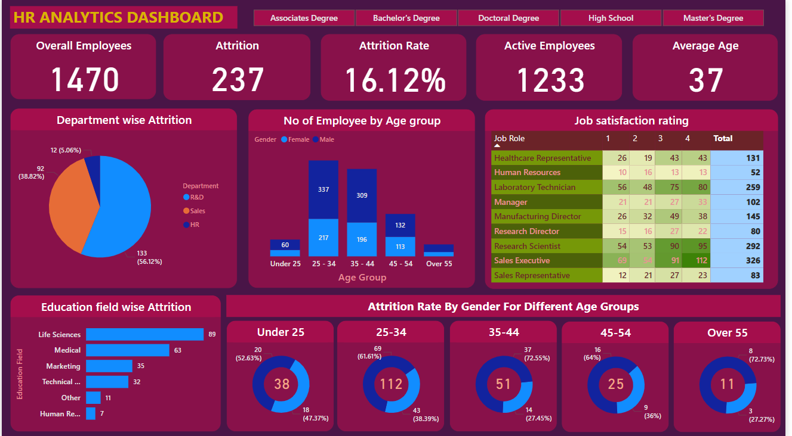

# HR-Dashboard

[Click Here to view the interactive version of this dashboard]([<iframe title="HR analytics" width="600" height="373.5" src="https://app.powerbi.com/view?r=eyJrIjoiMjI4ODliZjQtYTY0ZC00NzY0LWE0OWEtODQzYzM5OTE4MGVlIiwidCI6ImRmODY3OWNkLWE4MGUtNDVkOC05OWFjLWM4M2VkN2ZmOTVhMCJ9" frameborder="0" allowFullScreen="true"></iframe>](https://app.powerbi.com/view?r=eyJrIjoiMjI4ODliZjQtYTY0ZC00NzY0LWE0OWEtODQzYzM5OTE4MGVlIiwidCI6ImRmODY3OWNkLWE4MGUtNDVkOC05OWFjLWM4M2VkN2ZmOTVhMCJ9))

#### Overview
***The HR Analytics Dashboard provides a comprehensive overview of key HR metrics, focusing on employee attrition, demographics, job satisfaction, and education levels. It offers valuable insights for HR professionals to make data-driven decisions and improve employee retention and satisfaction.***

## Key Findings

#### Attrition

**Overall Attrition:** ***237*** employees have left the organization, representing an attrition rate of 16.12%. 
**Department-wise Attrition:** ***Sales Department*** has the highest attrition rate, followed by ***IT***. 
**Age Group Attrition:** The ***25-34 age group*** has the highest attrition rate, indicating potential areas for retention strategies. 
**Gender-wise Attrition:** There is no significant difference in attrition rates between genders. 

#### Demographics

**Overall Employees:** ***1470*** employees are currently employed. 
**Active Employees:** ***1233*** employees are actively working. 
**Average Age:** The average age of employees is ***37***. 
**Age Group Distribution:** The ***35-44 age group*** is the largest, followed by the ***25-34 age group***. 
**Gender Distribution:** The gender ratio is relatively balanced. 

#### Job Satisfaction

**Overall Job Satisfaction:** While the total satisfaction rating is not provided, the individual job role ratings offer insights into specific areas of satisfaction or dissatisfaction. 
**Job Role Satisfaction:** Research Scientist, Sales Representative, and Healthcare Representative have the highest satisfaction ratings, while Human Resources Technician and Laboratory Technician have the lowest. 

#### Education Levels

**Educational Background:** The majority of employees hold Bachelor's degrees, followed by Associates degrees. 
**Education-wise Attrition (Detailed):** This section provides a more granular breakdown of attrition rates based on specific educational fields. 

## Recommendations

Based on the dashboard's insights, the following recommendations can be made: 

**Target High-Attrition Departments:** Focus on improving retention strategies for Sales and IT departments. 
**Address Age-Group Specific Needs:** Implement initiatives to address the specific needs and concerns of employees in the 25-34 age group. 
**Review Job Satisfaction:** Conduct more in-depth surveys to understand the factors driving job satisfaction or dissatisfaction in specific roles. 
**Tailor Retention Strategies:** Develop targeted retention strategies based on educational background and field. 
**Enhance Employee Engagement:** Implement programs to improve employee engagement and satisfaction across all departments. 
By addressing these areas, the organization can enhance employee retention, improve job satisfaction, and create a more positive work environment.
